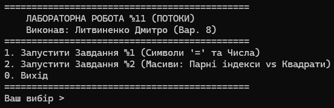
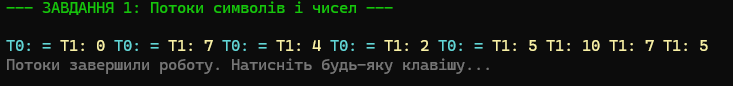
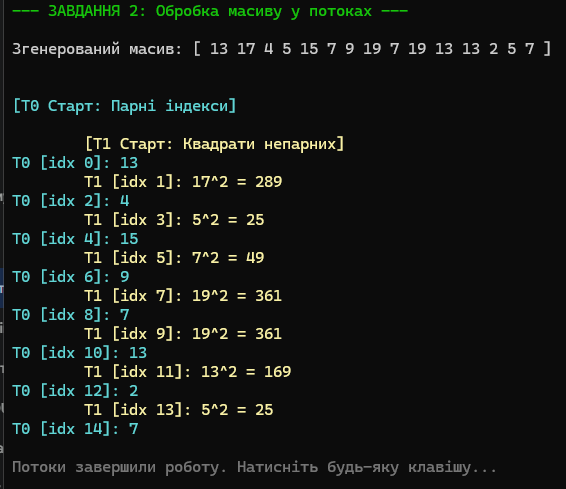

# Лабораторна робота №11: Багатопотоковість у .NET (C#)

**Тема:** Технології розподілених систем та паралельних обчислень.  
**Виконав:** Студент групи І-23, Литвиненко Дмитро (Варіант 8).

## 📝 Опис
Цей проєкт демонструє роботу з потоками (клас `System.Threading.Thread`) у мові C#. Реалізовано консольний додаток з інтерактивним меню, що дозволяє запускати два різні завдання паралельної обробки даних.

### ✅ Реалізований функціонал:
- **Багатопотоковість:** Використання `Thread.Start()`, `Thread.Sleep()`, `Thread.Join()`.
- **Thread Safety (Потокобезпека):** Використання `lock` для коректного виводу кольорового тексту в консоль без артефактів.
- **Інтерфейс:** Зручне консольне меню для вибору завдань.

---

## 📸 Скріншоти роботи

### Головне меню
Програма має зручний інтерфейс для навігації між завданнями:


### Завдання №1 (Варіант 8)
**Умова:**
- Потік **T0**: Виводить 5 символів «=».
- Потік **T1**: Виводить 8 випадкових чисел (0..10).

**Результат виконання:** Потоки працюють конкурентно, вивід перемішується у часі:


### Завдання №2 (Варіант 8 — Базовий рівень)
**Умова:**
- Є масив з 15 випадкових чисел.
- Потік **T0**: Обробляє та виводить елементи з **парними** індексами.
- Потік **T1**: Обробляє та виводить **квадрати** елементів з **непарними** індексами.

**Результат виконання:**


---

## 🚀 Як запустити
Вам знадобиться **.NET 8 SDK**.

1. Клонуйте репозиторій:
   ```bash
   git clone https://github.com/Lutvunenko-Dmutro/Lab11-Multithreading-CSharp.git

2.  Перейдіть у папку проєкту:
    ```bash
    cd Lab11-Multithreading-CSharp
    ```
3.  Запустіть проєкт:
    ```bash
    dotnet run
    ```

-----

© 2025 Литвиненко Дмитро

