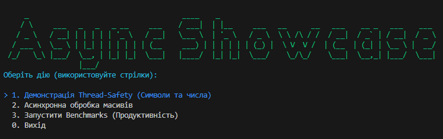
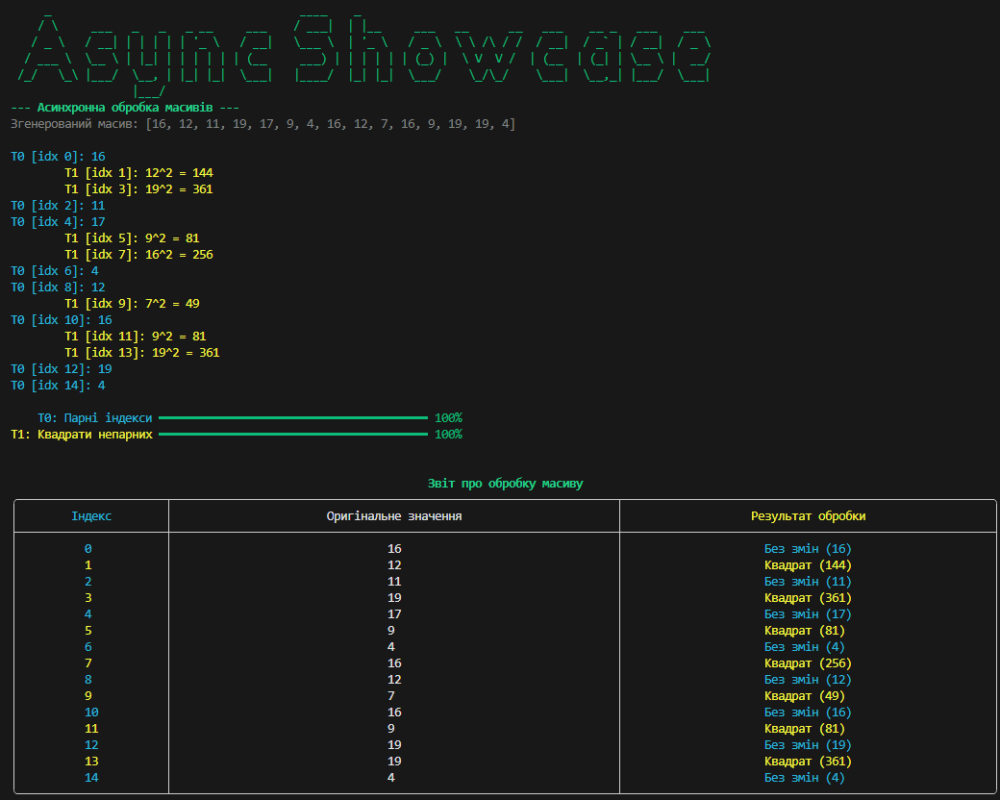

<div align="center">

# Async Showcase (.NET Concurrency) 🚀

[](https://github.com/Lutvunenko-Dmutro/Async-Showcase/actions/workflows/dotnet.yml)
[](https://dotnet.microsoft.com/)

> Проєкт, що демонструє використання сучасних стандартів багатопоточності в C# (TPL, `async/await`, `CancellationToken`).

</div>

---

## 📸 Демонстрація (Screenshots)

### Головне меню


### Процес виконання задач (Асинхронна обробка)


---

## 📖 Про проєкт

Початково цей проєкт був створений як університетська лабораторна робота для вивчення базової синхронізації (використання класів `Thread`, блокувань `lock` тощо). 

У **2026 році** код пройшов глибокий **Refactoring & Modernization**, щоб відповідати сучасним Enterprise-стандартам розробки на C#.

### 🛠 Що було покращено (Modernization 2026):
1. **Міграція з legacy `Thread` на Task Parallel Library (TPL):** Усі сирі потоки були замінені на `Task.Run()` та `await Task.WhenAll()`. Це значно оптимізувало використання пам'яті (завдяки ThreadPool) та усунуло блокування головного потоку.
2. **Чисті функції (Усунення глобального стану):** Статичні глобальні масиви замінено на локальний стан, який безпечно передається між завданнями. Це фундаментально унеможливило стан перегонів (Race Conditions).
3. **Оптимізація випадкових чисел:** Використання швидкого і потокобезпечного `Random.Shared` замість багатократних викликів `new Random()`.
4. **Кероване скасування (Graceful Shutdown):** Впроваджено `CancellationTokenSource`. При натисканні `Ctrl+C` програма не "вбивається" грубо через термінал, а коректно надсилає сигнал скасування всім паралельним задачам і безпечно завершує роботу.
5. **Візуальна естетика (Spectre.Console):** Стандартний консольний вивід повністю замінено на інтерактивне меню та "живі" прогрес-бари, які паралельно оновлюються різними тасками.
6. **Автоматизація (CI/CD):** Налаштовано GitHub Actions, який перевіряє компіляцію проєкту при кожному пуші.

---

## ⚡ Продуктивність (BenchmarkDotNet)

В університеті достатньо, щоб програма "просто працювала", але у професійному середовищі важливі **цифри**. Для вимірювання різниці між Legacy (сирі `Thread`) та Modern (`Task`) підходами була підключена бібліотека **BenchmarkDotNet**.

Ось результати вимірювання швидкості виконання та алокацій:

```ini
BenchmarkDotNet v0.15.8, Windows 11
11th Gen Intel Core i5-11400H 2.70GHz, 1 CPU, 12 logical and 6 physical cores
.NET SDK 10.0.302 (Host: .NET 8.0.22)
```

| Method                   | Mean       | Error     | StdDev    | Ratio |
|------------------------- |-----------:|----------:|----------:|------:|
| Legacy_ProcessArray      | 158.555 us | 3.0984 us | 5.8195 us | 1.000 |
| Modern_ProcessArrayAsync |   1.154 us | 0.0072 us | 0.0064 us | 0.007 |

**Висновок:** Використання сучасного підходу `Task.Run` прискорило створення та виконання паралельних задач **у 137 разів (з 158 us до 1.15 us)**! Створення "сирого" OS-потоку через `new Thread()` є надзвичайно ресурсоємною операцією порівняно з отриманням таски з пулу потоків (ThreadPool).

---

## 🚀 Як запустити?

1. Переконайтесь, що встановлено **.NET 8 SDK**.
2. Відкрийте термінал у папці з проєктом та виконайте:
   ```bash
   dotnet run
   ```
3. Для самостійного запуску Бенчмарків (вимірювання продуктивності):
   ```bash
   dotnet run -c Release -- --benchmark
   ```

---
*Created by [Dmytro Lytvynenko](https://github.com/Lutvunenko-Dmutro)*
